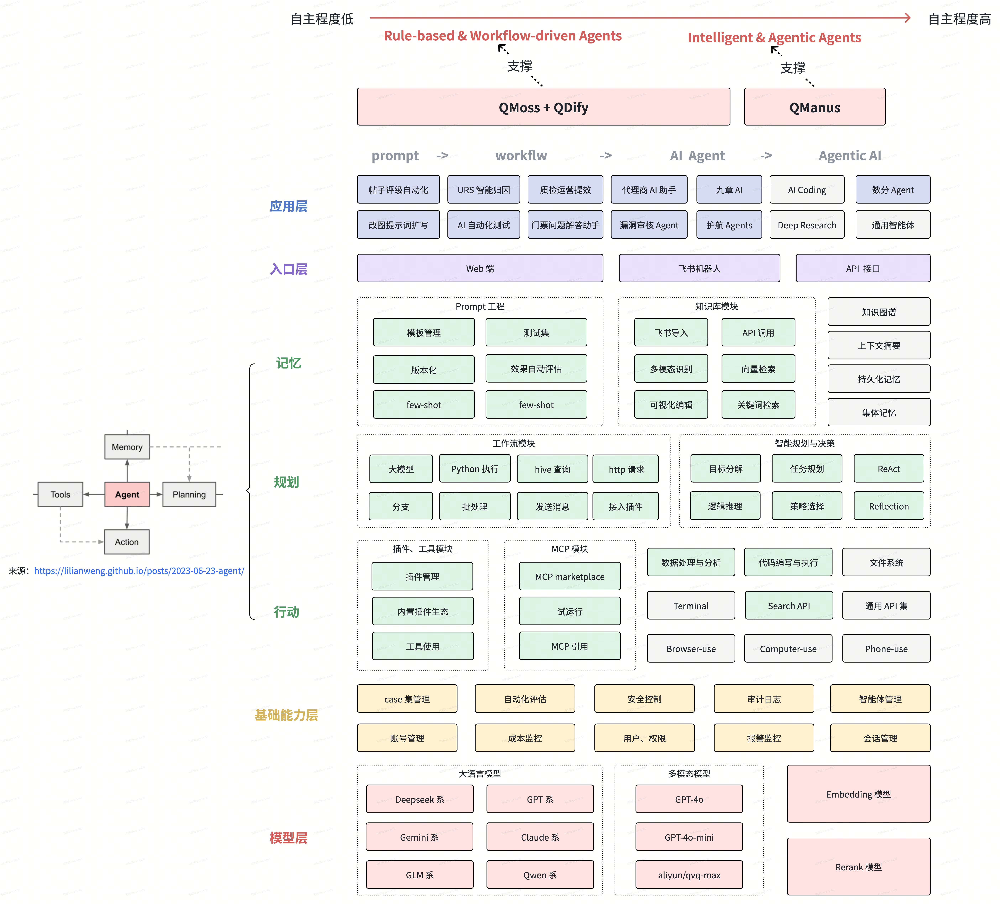
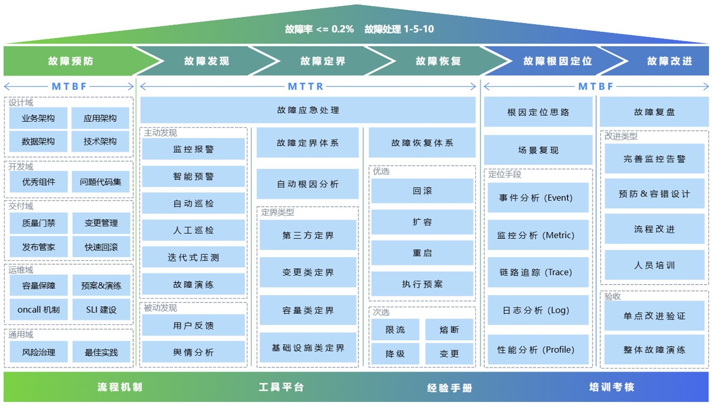
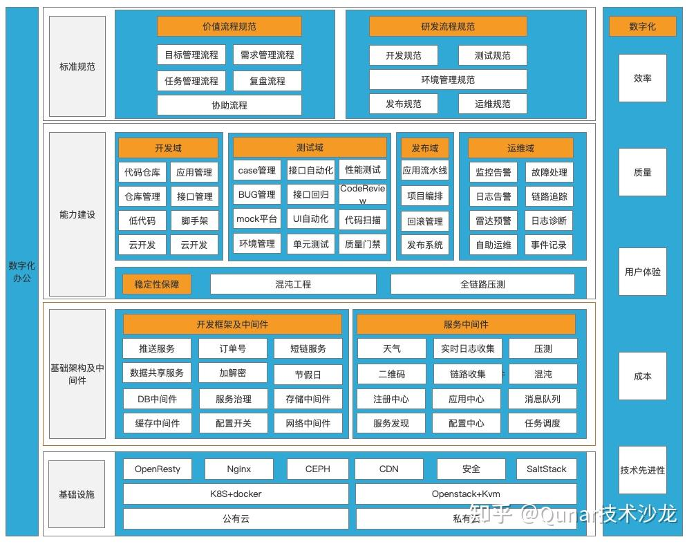

# 马阳阳

29 岁 | 暂居北京 | 176-1024-5400 | 1135038815@qq.com

意向岗位：研发效能/Agent开发 技术专家/架构师/技术总监 | 意向城市：上海

## Summary

- 去哪儿旅行技术总监，负责 AI 研发体系与企业级稳定性架构建设
- 8 年研发效能经验，近 3 年技术管理经验，负责基础平台研发与公共 QA 团队（10+ 人规模）
- 带领团队完成多个 0 到 100 的平台建设，通过明确平台生态位与产品边界，完成平台在全司规模化落地
- 具备体系化管理与战略规划能力，熟练运用 战略地图、OKR、DMAIC 推动组织与技术演进
- 长期高绩效，连续晋升，个人和团队多次获得公司级奖项

## 负责板块

### 1. AI 驱动质效升级

关键动作：
- AI 基建：构建 企业级智能体平台（覆盖无代码开发）、LangChain4j-Qunar（覆盖代码开发）、Agent 可观测性，降低 AI 应用开发门槛
- 场景落地：建设 AI Code Review、AI 数据分析、AI 项目助手 3 大场景，覆盖 100% BU
- AI Coding 体系：
  - 组织：组建 AI 研发 SIG，双周运营与 SOP 沉淀，推动全司协同落地
  - 工具：搭建自动开发平台（覆盖 0.5 PD 小需求）、CodeWiki（覆盖历史工程）、Skill hub、数据采集工具，提升研发自动化能力
  - 数据：制定 L1-L5 标准，建设跨 CLI 的会话采集、洞察能力，沉淀研发行为数据资产，构建 AI 出码率、需求覆盖率等指标体系与全司看板

结果：
- AI Code Review 全司落地，评审效率提升 56.34%，千行代码优化数 1.3 个
- Data Agent(QNova) 覆盖 20+ 业务场景，业务指标分析效率从“天级”降低到“分钟级”，成为管理者日常使用工具
- 自研智能体平台 QMoss 全年稳定性 100%，实现 Dify 企业级本地化改造并落地定期升级机制
- 平台覆盖 60+ 三级 BU，落地 3500+ 流程。AI 应用构建周期从“天级”缩短至“分钟级”，年度累计提效超 4.4 万 PD，具备行业级领先
- AI Coding 出码率达 70%（阶段性成果），初步构建了 "数据驱动 → 能力沉淀 → 平台化落地 → 组织推广 → 数据反馈" 的 AI 研发闭环

### 2. SRE 体系

目标：
- 公司：全司故障率 <= 0.2%，P1/P2 故障 1-5-10 达标率 50%
- BU：基础架构 BU 故障率 <= 0.1%，25 全年故障 <= 6 个

关键动作：
- 指标驱动：升级质量度量体系，涵盖 1-5-10 指标，建立全司通晒与月度运营机制，驱动 BU 持续优化
- 故障治理：横向介入全 BU 故障复盘，分析 5 年故障根因并平台化治理，沉淀跨 BU 风险复用机制
- 依赖治理：建设公司级依赖分级与治理体系（数据沉淀 / 演练平台 / 发布门禁），消除非对等强依赖风险
- 基建加固：增设基础架构 SRE 负责人，覆盖容灾、容量、变更、演练、预案、运营六大方向，建立 SLO 机制并实现基建 100% 覆盖
- 压测升级：升级压测平台（脉冲压测 0.3s 峰值 10W QPS），覆盖 100% 流量场景

成果：
- 25 年，全司故障率降至 0.08%；基础架构 BU 故障数 YoY 从 9 降到 0（Top 1 BU）
- 建立常态化 "检测-演练-治理-运营" 依赖闭环，强弱依赖导致的 P1/P2 故障降为 0，累计规避线上问题 548 个
- 补全启动时依赖、累计容量、主机一致性检查、证书更新等多个细分风险治理，全司落地

### 3. 研发效能体系版本演进

目标：建立并完善开发域、测试域平台能力

关键动作：
- 清理技术债，全司总代码量精简 50%，项目导致故障数 <= 1
- 打造组件市场V1.0，形成至少 5 个代表组件，提供复用性，覆盖 100+ AppCode
- 测试环境平台（Noah）V3.0 升级，通过建立软路由、环境保障，重构编排系统，提升环境效率、降低机器成本

结果：
- 搭建瘦身平台 ACED，利用 JDK 底层技术，实现 0 性能损耗、0 风险探测函数是否有流量。对比常见的代码覆盖率、Java 探针方案，具备明显稳定性优势
- 全司代码量减少 50.21%（2500W+ 行），服务数 -26%。发布效率提升 9.5%，需求交付时长降低 10.9%，项目故障数 0
- 孵化 7 个公司级核心组件（分布式锁、可观测线程池、压缩组件等），覆盖 300+ AppCode，组件 BUG 导致的故障 0
- Noah 机器资源成本减少 360 万，环境构建成功率绝对提升 35.2%，年化节约人力成本 1200+ PD，环境导致需求 Delay 率减少 90%

## 工作经历

**去哪儿旅行** — 北京

技术总监 · 基础平台开发、公共 QA 团队负责人（2024-01 — 至今）

资深研发工程师 · 基础平台团队核心开发（2021-08 — 2023-12）

**北京宝兰德软件股份有限公司** — 北京

高级研发工程师（2017-12 — 2021-08）— 私有云 PaaS 平台核心开发，基于 Kubernetes，负责 CI/CD 流水线、灰度发布、镜像库、弹性伸缩等模块

---

## 教育背景

**南京晓庄学院** · 2014~2018 · 统招本科 · 软件工程 · GPA 排名 Top 10

---

## 荣誉

- 热爱分享交流，有影响力：作为讲师参加 ArchSubmit、Top100、QECon、SECon、A2M、DBAPlus、ITCP 等行业大会，获得明星讲师称号；组织过多场跨公司闭门交流会
- 具备公司级横向组织、推进能力：26 年担任 AI Coding SIG 秘书长，推动 AI Coding 在全司体系化、规模化落地；22、23 年分别担任技术 SIG 秘书长、负责人
- 乐于培养他人：带团队期间，个人晋升成功率 87.5%，远超平均水平（全司均值 < 50%）
- 有建团队、稳定性提升经验：25 年初组建基础架构 QA 团队，负责基础架构稳定、大客户端框架质量保证与发版。基础架构 BU 全年故障数 0 个，在全司 10+ 三级 BU 中排名第 1，相比 24 年故障数减少 9 个
- 长期高绩效：3 次 A（Top 10%）、4 次 B（Top 30%）；最近一次 2025H2 为 A
- 连续晋升：4 年 3 次高职级个人晋升，成功率 100%（全司均值 < 50%）
- 多次获奖：23 年带队包揽 CR 大赛冠军和 AI Hackathon 大赛第 1 名；23 年技术品牌突出贡献奖；4 年公司内训师；飞书效率先锋；公司飞书社群 KOL；大四校一等奖学金；大三校二等奖学金